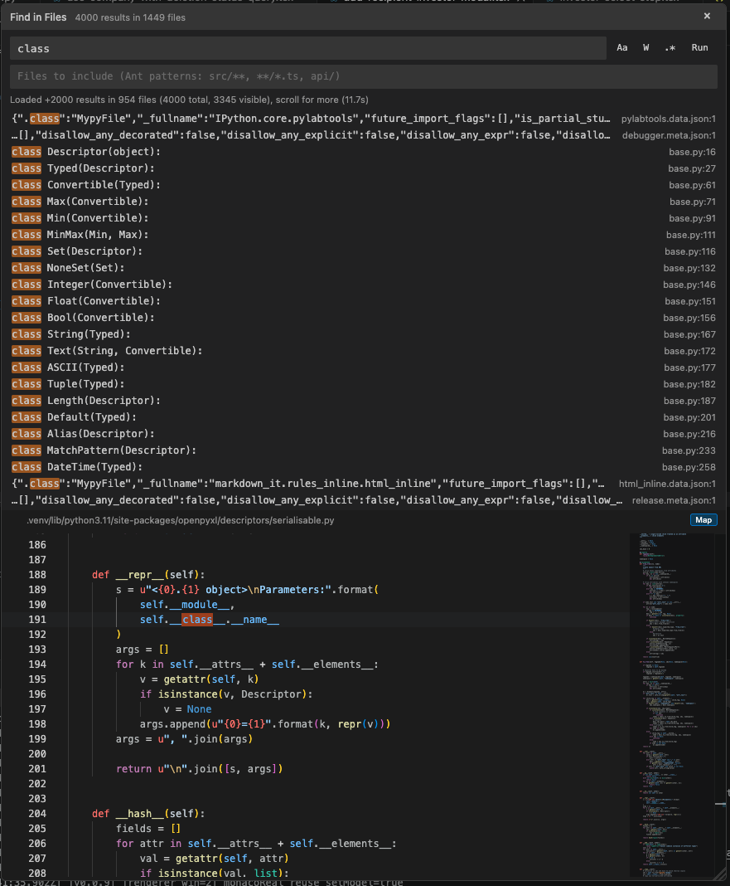

# IntelliJ Styled Search

IntelliJ Styled Search adds an IntelliJ IDEA-like project search panel to VS Code. It opens as a movable overlay, streams workspace results, and shows an editable Monaco preview for the selected match.



## Features

- Find in project from a movable IntelliJ-style overlay.
- Search the selected text directly from the editor context menu or keybinding.
- Preview matches in an embedded Monaco editor with hover, completions, and editor-style highlighting when renderer capture is available.
- Narrow large searches with a local trigram index, then verify results with ripgrep.
- Support literal, regex, case-sensitive, whole-word, and multi-line searches.
- Keep results responsive by streaming matches and showing candidate files while ripgrep is still running.

## Commands

| Command | Description |
| --- | --- |
| `IntelliJ Search: Find in Path (IntelliJ Style)` | Open the search panel. |
| `IntelliJ Search: Find Selection in Project` | Search the current selection. |
| `IntelliJ Search: Reinject Renderer Patch (Recovery)` | Reinstall the renderer overlay if VS Code's renderer state changes. |
| `IntelliJ Search: Rebuild Search Index` | Rebuild the trigram search index. |
| `IntelliJ Search: Diagnose Active File in Search Index` | Inspect why the active file may not be in the index. |

## Keybindings

| Platform | Search Selection | Open Search |
| --- | --- | --- |
| macOS | `Cmd+Shift+Alt+F` | `Cmd+Shift+Alt+P` |
| Windows/Linux | `Ctrl+Shift+Alt+F` | `Ctrl+Shift+Alt+P` |

## Settings

| Setting | Default | Description |
| --- | --- | --- |
| `intellijStyledSearch.excludeGlobs` | common build/cache folders | Glob patterns excluded from full searches. |
| `intellijStyledSearch.maxFileSize` | `1048576` | Maximum file size in bytes to search. |
| `intellijStyledSearch.maxResults` | `2000` | Maximum number of match lines to return. |

## Runtime Notes

On first activation, the extension attempts to install a platform-specific ripgrep binary into VS Code's extension global storage. If that install fails or the platform is unsupported, it falls back to VS Code's bundled ripgrep when available, and finally to the JavaScript search path.

The editable preview relies on VS Code renderer internals. If the overlay appears but the preview falls back to plain DOM rendering, run `IntelliJ Search: Reinject Renderer Patch (Recovery)`.

## Development

```bash
npm install
npm run compile
npm test
```

Package locally:

```bash
vsce package
```

