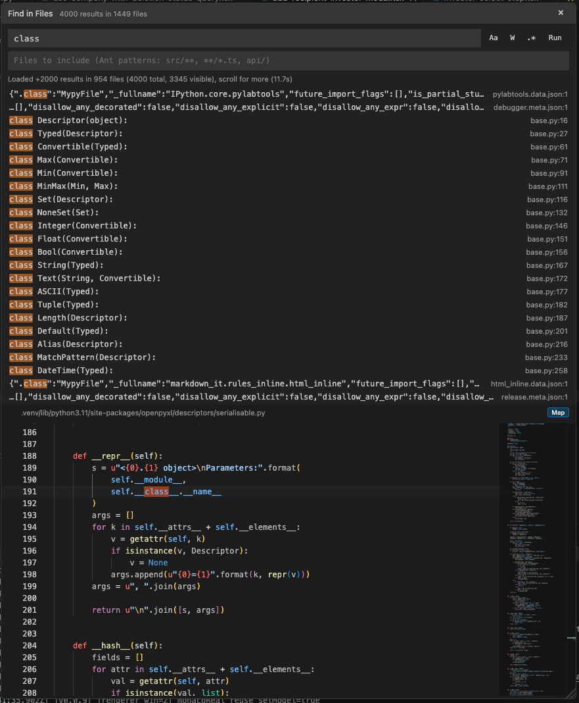

# IntelliJ Styled Search

IntelliJ Styled Search adds an IntelliJ IDEA-like project search panel to VS Code. It opens as a movable overlay, streams workspace results, and shows an editable Monaco preview for the selected match.



## Features

- Find in project from a movable IntelliJ-style overlay.
- Search the selected text directly from the editor context menu or keybinding.
- Preview matches in an embedded Monaco editor with installed VS Code TextMate grammars, immediate lexical hover, and VS Code semantic hover, completions, navigation, diagnostics, and semantic highlighting relayed into the bundled editor.
- Narrow large searches with a local trigram index, then verify results with ripgrep.
- Support literal, regex, case-sensitive, whole-word, and multi-line searches.
- Keep results responsive by streaming matches and showing candidate files while ripgrep is still running.

## Commands

| Command | Description |
| --- | --- |
| `IntelliJ Search: Find in Path (IntelliJ Style)` | Open the search panel. |
| `IntelliJ Search: Find Selection in Project` | Search the current selection. |
| `IntelliJ Search: Reinject Renderer Patch (Recovery)` | Reinstall the renderer overlay if VS Code's renderer state changes. |
| `IntelliJ Search: Rebuild Search Index` | Rebuild the trigram search index. |
| `IntelliJ Search: Switch Search Engine` | Switch between `zoekt` and `codesearch`, then rebuild the selected engine. |
| `IntelliJ Search: Show Zoekt Diagnostics` | Print shard, overlay, journal, and process stats for the Rust engine. |
| `IntelliJ Search: Explain Query With Zoekt` | Print the Rust engine's candidate plan for a query. |
| `IntelliJ Search: Diagnose Active File in Search Index` | Inspect why the active file may not be in the index. |
| `IntelliJ Search: Start Codeidx MCP Server` | Start the local Codeidx MCP endpoint for Codex, Claude, and other MCP clients. |
| `IntelliJ Search: Stop Codeidx MCP Server` | Stop the local Codeidx MCP endpoint. |

## MCP Usage

This repository includes project MCP config files:

- `.mcp.json` for Claude Code project-scoped MCP discovery.
- `.codex/config.toml` for Codex project-scoped MCP configuration when supported by the installed Codex CLI.

The MCP clients spawn a stdio proxy, but the proxy still needs the VS Code extension's localhost endpoint. In trusted workspaces the extension auto-starts that endpoint by default. Each VS Code window binds an OS-assigned free port and writes the actual URL to `.codeidx/mcp-server.json`, so multiple projects can run at the same time without sharing a fixed port. The extension also writes `.codeidx/codeidx-mcp-stdio.js`, which lets project MCP configs launch the proxy through `node` without depending on a global `codeidx-mcp` binary. Auto-setup writes only project-local MCP config files such as `.mcp.json` and `.codex/config.toml`; it does not write `~/.codex/config.toml` or any other user/global MCP config.

Manual stdio proxy command:

```bash
codeidx-mcp stdio --workspace .
```

From a workspace where the extension has started, use the generated project launcher:

```bash
node .codeidx/codeidx-mcp-stdio.js stdio --workspace .
```

The proxy discovers the VS Code endpoint from `.codeidx/mcp-server.json` and verifies that the endpoint reports the same workspace ID. A stale `CODEIDX_MCP_URL` from another VS Code window is ignored instead of pinning the proxy to the wrong project. If you disable `intellijStyledSearch.mcpAutoStart`, the extension still publishes a workspace-local control API in `.codeidx/mcp-control.json`; agents can call `mcp_start` from the stopped stdio fallback to ask that VS Code window to start the workspace MCP endpoint. You can also pass the URL explicitly:

```bash
codeidx-mcp stdio --url http://127.0.0.1:<port>/mcp
```

Codex should use the generated project-scoped `.codex/config.toml` when your Codex CLI supports it. Avoid `codex mcp add` for this launcher when it writes to `~/.codex/config.toml`, because user/global MCP config can pin `codeidx` to one workspace. If a global entry is necessary, use a cwd-based command rather than a project-specific `.codeidx/codeidx-mcp-stdio.js` absolute path.

Claude Code example:

```bash
claude mcp add --transport stdio codeidx -- node .codeidx/codeidx-mcp-stdio.js stdio --workspace .
```

Claude Code also auto-detects the checked-in `.mcp.json` after you approve the project-scoped MCP server.

Useful MCP self-check tools:

- `mcp_health`: verifies the MCP connection and reports endpoint, discovery file, capabilities, index status, and the agent startup policy.
- `mcp_start`: when `mcp_health` reports `health.mcp_connection == "stopped"` and `control.available == true`, asks the VS Code extension control API to start this workspace's MCP endpoint.

Agents should initialize codeidx with `mcp_health({ "include_agent_policy": true, "include_discovery": true })`, then follow the policy returned in `agent_policy`. If health reports `health.mcp_connection == "stopped"` and the stopped stdio fallback advertises `mcp_start`, call `mcp_start` once, rediscover, then call `mcp_health` again before using search, symbol, reference, or graph tools. Unless higher-priority user or project policy such as `AGENTS.md`, `CLAUDE.md`, or direct user instructions says otherwise, agents should automatically use codeidx before broad grep or whole-file reads: use `codeidx_probe`/`codeidx_exists` for cardinality, `codeidx_search_code` with `output_mode: "minimal"` for path:line candidates, and only then expand selected ranges with `codeidx_read_snippets` or `codeidx_symbol_slice`. MCP intentionally does not expose index refresh/rebuild tools; if the index is not ready, a full scan is required, or final audit ordering matters, fall back to `rg` or ask the user to prepare the index.

Native OR search is available through `queries`; the engine unions per-term index candidates before verification, so this avoids broad regex alternation for simple keyword sets:

```json
{
  "queries": ["AlphaService", "BetaService", "GammaService"],
  "query_kind": "literal",
  "query_operator": "any"
}
```

By default, `codeidx_search_code` protects common dependency/generated/sensitive paths such as `node_modules/**`, `out/**`, `dist/**`, `graphql-codegen/**`, and `.env*`. To deliberately search a normally excluded path, pass a narrow include plus an exclude policy override:

```json
{
  "query": "SomeGeneratedSymbol",
  "include_globs": ["out/**/*.js"],
  "exclude_policy": "custom_only"
}
```

Use `exclude_policy: "none"` only when you intentionally want to ignore both default excludes and `exclude_globs`.
Both override modes bypass `intellijStyledSearch.excludeGlobs` for that MCP request; keep `include_globs` narrow when searching dependency or generated trees.
For generated/codegen searches, `include_generated: true` disables generated excludes and uses a bounded full scan with a larger MCP file-size cap so large generated files are not silently missed.
If a generated/full-scan request explicitly forbids fallback, MCP returns `fallback_policy_requires_full_scan` instead of pretending the indexed search found zero results.

`codeidx_search_code` defaults to token-first `output_mode: "minimal"` and returns only `path:line` rows. Use `output_mode: "rg_like"` when you need line previews, and `codeidx_read_snippets` for selected ranges instead of paying snippet cost in the broad search response.
Compact search diagnostics are opt-in for compact text calls: pass `"include_diagnostics": true` when you need engine/fallback/scope/timing metadata in `structuredContent`. Pass `"structured": true` or `"output_mode": "structured"` only for full JSON-rich search results.
Pass `"diagnostic_level": "full"` only when you need full query terms and verbose ranking metadata.
Scope presets are explicit: `source` means production plus tests while excluding migrations/generated/dependencies/local editor context, `production` excludes tests too, `tests` keeps only tests, and `all` disables those preset filters.
For architectural inventories, `codeidx_top_files` supports `group_by: "directory"` plus `directory_depth`; this is useful for summarizing where notification implementations, senders, or callers are concentrated before reading files.

Example prompt for Codex or Claude:

```text
Use the codeidx MCP mcp_health tool, then search for "UserService" with codeidx_search_symbols first and codeidx_search_code if text locations are needed.
```

## Keybindings

| Platform | Search Selection | Open Search |
| --- | --- | --- |
| macOS | `Cmd+Shift+Alt+F` | `Cmd+Shift+Alt+P` |
| Windows/Linux | `Ctrl+Shift+Alt+F` | `Ctrl+Shift+Alt+P` |

## Settings

| Setting | Default | Description |
| --- | --- | --- |
| `intellijStyledSearch.engine` | `zoekt` | Search engine selection. `zoekt` uses the Rust local shard/mmap engine and falls back to `codesearch` while the runtime is unavailable or still preparing its index. `codesearch` is the current TypeScript codesearch planner plus ripgrep verifier. |
| `intellijStyledSearch.excludeGlobs` | `[]` | User-controlled glob patterns excluded from full searches. |
| `intellijStyledSearch.callGraphExcludeGlobs` | common dependency/build/cache folders | Glob patterns excluded only from call graph rebuilds; set to `[]` to include those folders intentionally. |
| `intellijStyledSearch.callGraphMemoryBudgetMb` | `8192` | Total memory ceiling for full call graph rebuilds. It caps the JavaScript worker heap and the Rust process/spill buffers. |
| `intellijStyledSearch.disableMonacoCapture` | `false` | Disable probing VS Code's private Monaco services. The bundled Monaco preview and its VS Code language-provider bridge remain available. |
| `intellijStyledSearch.allowTransientPreviewCaptureEditor` | `true` | Allow a short-lived background editor when passive capture cannot upgrade the bundled preview to VS Code's native editor. Disable it to guarantee Search never changes editor tabs. |
| `intellijStyledSearch.previewLanguageFeatures` | `true` | Enable bundled TextMate/lexical hover and relay semantic hover, completions, navigation, diagnostics, and semantic tokens from VS Code language providers. |
| `intellijStyledSearch.maxFileSize` | `1048576` | Maximum file size in bytes to search. |
| `intellijStyledSearch.maxResults` | `2000` | Match lines to load per batch. Scrolling near the bottom loads the next batch. Values at or below `0` use the built-in default. |
| `intellijStyledSearch.searchHistoryLimit` | `100` | Executed search queries to keep in the History dropdown. Set to `0` to disable storing search history. |

## Runtime Notes

On first activation, the extension attempts to install a platform-specific ripgrep binary into VS Code's extension global storage. If that install fails or the platform is unsupported, it falls back to VS Code's bundled ripgrep when available, and finally to the JavaScript search path.

Zoekt indexes are kept fresh with incremental updates for VS Code create/save/delete/rename operations plus external filesystem create/change/delete events. A search drains queued updates before querying the index; unsaved editor buffers are reported as dirty overlay state because they are not yet durable index input. Symbol search also filters deleted/missing-file results before returning them and queues a semantic incremental update when stale symbols are observed.

Search and call graph indexing check host-wide available memory before starting. While an isolated index process runs, sustained memory pressure is sampled and the process is stopped before it can exhaust the machine. Background full builds are deferred to a later trigger, while pending compactions and incremental batches retain their work and retry after pressure subsides; manual rebuilds report the available/required memory totals.

The tab-free bundled preview is the guaranteed path. It uses real file URIs, lazily reads the installed extensions' `contributes.languages`/`contributes.grammars` assets without activating those extensions, and relays VS Code language providers without opening an editor tab. TextMate grammar failures or safety-budget overruns fall back to Monaco's bundled tokenizer. When passive renderer capture is available, the preview may upgrade to VS Code's native editor services. Workspace language requests use the saved VS Code document snapshot, so a bundled preview pauses them while it has unsaved edits and resumes them after a successful save instead of showing stale ranges. If the overlay or preview fails to mount after a VS Code update, run `IntelliJ Search: Reinject Renderer Patch (Recovery)`.

## Development

```bash
npm install
npm run compile
npm test
npm run bench:zoekt -- --files 10000,50000,100000
```

`npm run bench:zoekt` saves a timestamped artifact plus `latest.json` under `artifacts/benchmarks/zoekt/`. The artifact includes the raw benchmark response, wall-clock runtime, git commit, Rust toolchain versions, and host metadata so repeated runs stay comparable.

## Deployment

Deployment and release steps now live in [DEPLOY.md](DEPLOY.md).

Short version:

- `vsce package` builds a lightweight VSIX from the current `.vscodeignore`.
- Without a `resources/bin/<platform-arch>/` tuple it relies on the global Cargo cache and a one-time local Rust build per Rust-source revision.
- Run `npm run build:zoek-runtime` before packaging a self-contained host-platform VSIX; use the explicit target options in `DEPLOY.md` for cross-platform artifacts.

Quick local package:

```bash
vsce package
```
